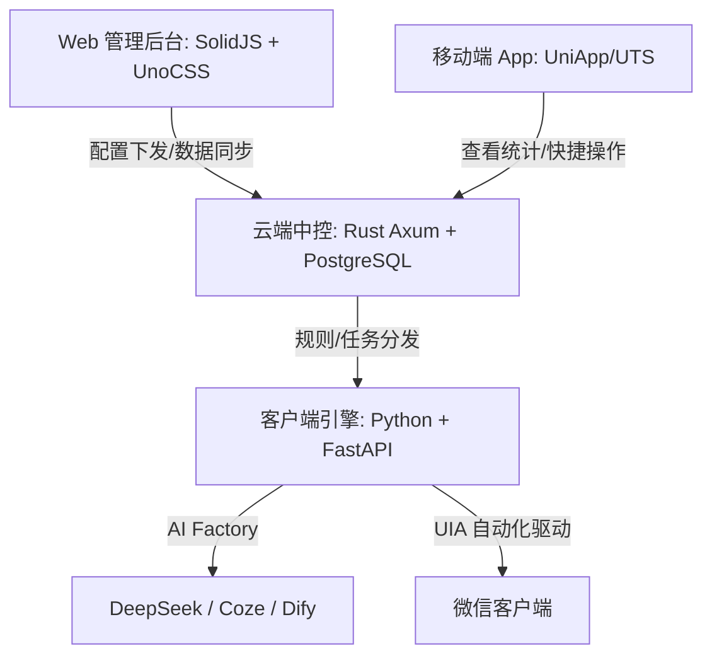

# 🤖 XM-Bot4 · 私域 AI 销冠系统

### 🚀 24小时不打烊的 AI 销冠助理 | RPA 驱动 | 全行业私域营销自动化平台

[🔥 商业合作/获取授权](#-商业合作与购买通道) | [💡 核心功能](#-核心功能) | [💼 行业解决方案](#-全行业解决方案)

---

## 📺 16S 极速演示：智能流程自动化 (RPA)

> **基于 Windows UIA 模拟人工技术，安全稳定，像真人一样自动加粉破冰：**

  

---

## 📷 核心功能界面预览

  <h4>🖥️ 功能模块一：界面隐私设置</h4>
  

    

  <h4>🖥️ 功能模块二：AI 智能回复设置</h4>
  

    

  <h4>🖥️ 功能模块三：批量拓客界面</h4>
  

    

  <h4>🖥️ 功能模块四：朋友圈智能管理</h4>
  
    
  

---

## 💡 为什么选择 XM-Bot4？

做私域最怕的是什么？**流量来了接不住，接住了又聊死，聊活了又累死。**
XM-Bot4 是专为老板和销售团队打造的“不拿工资、24 小时在线”的 **AI 销冠助理**。

*   **⚡ 24小时秒回：** 接入 Coze / Dify / DeepSeek 等多平台 AI 工厂，模仿真人语气（带表情包）秒回刁钻问题，留住深夜流量。
*   **🎯 智能客户分级：** 聊天中自动识别客户意向，生成“高意向”、“预算 5000+”等精准标签，拒绝低效沟通。
*   **📅 朋友圈全托管：** AI 自动生成行业文案与配图建议，定时排期自动发送，持续建立客户信任。
*   **🛡️ 独创安全护盾：** 采用 Windows UIA 模拟人工点击技术，不破解协议、不封号，顺应官方规则安全运行。

---

## 💼 全行业解决方案 (各行各业都在用)

XM-Bot4 提供多套开箱即用的行业 AI 知识库与工作流，无论您在哪个赛道，都能无缝接入：

### 🛒 1. 电商与新零售 (淘宝/小红书/抖音商家)
*   **痛点：** 流量导入微信后流失率高，客服忙不过来。
*   **方案：** 扫码入群后，AI 助理 24 小时自动破冰，派发福利券；智能识别高净值客户，引导大额复购。

### 🎓 2. 教育培训与咨询服务
*   **痛点：** 意向家长咨询多，跟进不及时，顾问手动建档效率低。
*   **方案：** AI 自动解答课程大纲、价格等常见问题，根据聊天内容标记“意向科目”、“孩子年级”，并实时通知人工顾问接管。

### 💅 3. 美业、健身与本地生活
*   **痛点：** 会员粘性差，预约时间冲突，到期提醒耗时。
*   **方案：** AI 定期发送暖心关怀；支持自动对接预约日历，客户在微信中即可通过 AI 助理自助预约。

### 🏢 4. B2B 企业服务与房产中介
*   **痛点：** 展会或裂变收集了上千个线索，逐个添加跟进耗时长、回复慢。
*   **方案：** 自动导入电话号码，批量发送真诚的个性化破冰申请，添加成功率翻倍，首条消息自动发送产品介绍册。

---

## 🏗️ 系统架构图

本项目由 **XMCore** 统一技术栈驱动，保证卓越的并发性能与数据安全性：

---

## 🤝 商业合作与购买通道
本项目不开源核心商业代码，仅提供技术架构展示与商业版部署方案。

### 🎁 商业版包含：
多端中控后台： 网页端 + 手机 App，随时随地查看各台设备加粉、聊天、发圈数据。
AI 工厂完美配置： 协助配置专属的行业大模型知识库（支持上传您的产品手册，让 AI 越聊越聪明）。
安全更新支持： 持续适配微信版本更新，确保系统长效稳定运行。
### 📞 扫码或联系我们获取详细演示：

💬 备注：GitHub 咨询 XM-Bot4，即可免费获取《AI 私域引流变现白皮书》

## ⚖️ 免责声明
本项目仅供学术研究、个人学习以及 RPA (机器人流程自动化) 技术的研究探索。
任何人使用本项目进行任何形式的商业行为、非法营销、恶意骚扰、以及违反微信等平台服务协议的活动，其全部法律后果及由于平台封号等带来的经济损失均由使用者自行承担，与本项目作者无关。
请在法律和平台规则允许的范围内合理使用。
